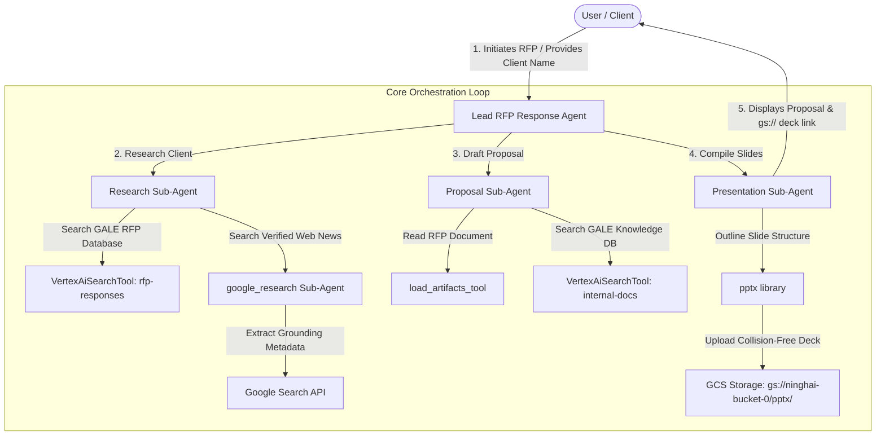

# Grounded RFP & Presentation Generation Agent

A state-of-the-art, multi-agent Reasoning Engine built with Google's **Agent Development Kit (ADK)**. The GALE RFP Agent automates the entire client proposal lifecycle—from deep research and semantic citation grounding to draft generation and PowerPoint deck publishing.

---

## 🏗️ Agentic Architecture Diagram

The orchestrator manages the sequential interaction and strict delegation between specialized agents and tools:



## Project Structure

```
rfp-agent/
├── rfp_agent/         # Core agent codebase
│   ├── agent.py                # Main Lead Agent Orchestration
│   ├── prompts/                # 100% isolated Markdown Prompt Files
│   │   ├── research_agent_instruction.md
│   │   ├── generate_rfp_agent_instruction.md
│   │   └── ppt_agent_instruction.md
│   └── sub_agents/             # Specialized sub-agents and tools
│       ├── research_agent.py
│       ├── generate_rfp_agent.py
│       ├── ppt_agent.py
│       └── google_research/     # Grounded Search Specialist Sub-Agent
├── tests/             # Interactive conversational test suites
└── pyproject.toml     # Project dependency configs
```

💡 **Tip:** Use [Gemini CLI](https://github.com/google-gemini/gemini-cli) for AI-assisted development - project context is pre-configured in `GEMINI.md`.

## Requirements

Before you begin, ensure you have:
- **uv**: Python package manager (used for all dependency management in this project) - [Install](https://docs.astral.sh/uv/getting-started/installation/) ([add packages](https://docs.astral.sh/uv/concepts/dependencies/) with `uv add <package>`)
- **agents-cli**: Agents CLI - Install with `uv tool install google-agents-cli`
- **Google Cloud SDK**: For GCP services - [Install](https://cloud.google.com/sdk/docs/install)


## Quick Start

Install required packages:

```bash
agents-cli install
```

Test the agent with a local web server:

```bash
agents-cli playground
```

You can also use features from the [ADK](https://adk.dev/) CLI with `uv run adk`.

## Commands

| Command              | Description                                                                                 |
| -------------------- | ------------------------------------------------------------------------------------------- |
| `agents-cli install` | Install dependencies using uv                                                         |
| `agents-cli playground` | Launch local development environment                                                  |
| `agents-cli lint`    | Run code quality checks                                                               |
| `uv run pytest tests/unit tests/integration` | Run unit and integration tests                                                        |

## 🛠️ Project Management

| Command | What It Does |
|---------|--------------|
| `agents-cli scaffold enhance` | Add CI/CD pipelines and Terraform infrastructure |
| `agents-cli infra cicd` | One-command setup of entire CI/CD pipeline + infrastructure |
| `agents-cli scaffold upgrade` | Auto-upgrade to latest version while preserving customizations |

---

## Development

Edit your agent logic in `app/agent.py` and test with `agents-cli playground` - it auto-reloads on save.

## Deployment

```bash
gcloud config set project <your-project-id>
agents-cli deploy
```

To add CI/CD and Terraform, run `agents-cli scaffold enhance`.
To set up your production infrastructure, run `agents-cli infra cicd`.

## Observability

Built-in telemetry exports to Cloud Trace, BigQuery, and Cloud Logging.
